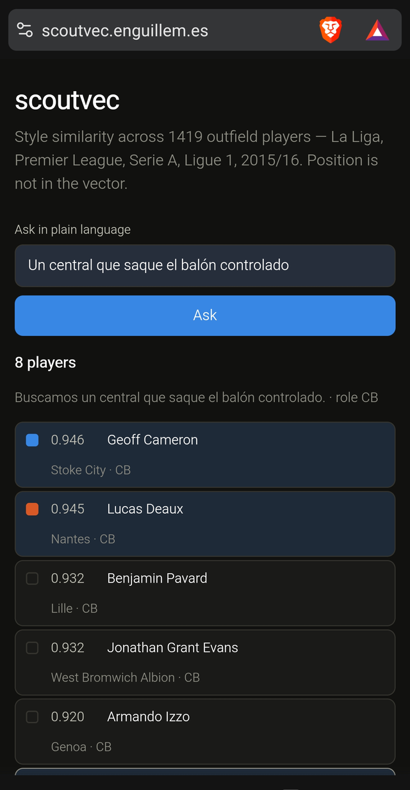
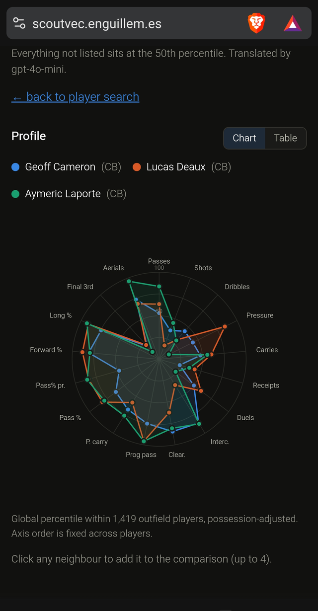
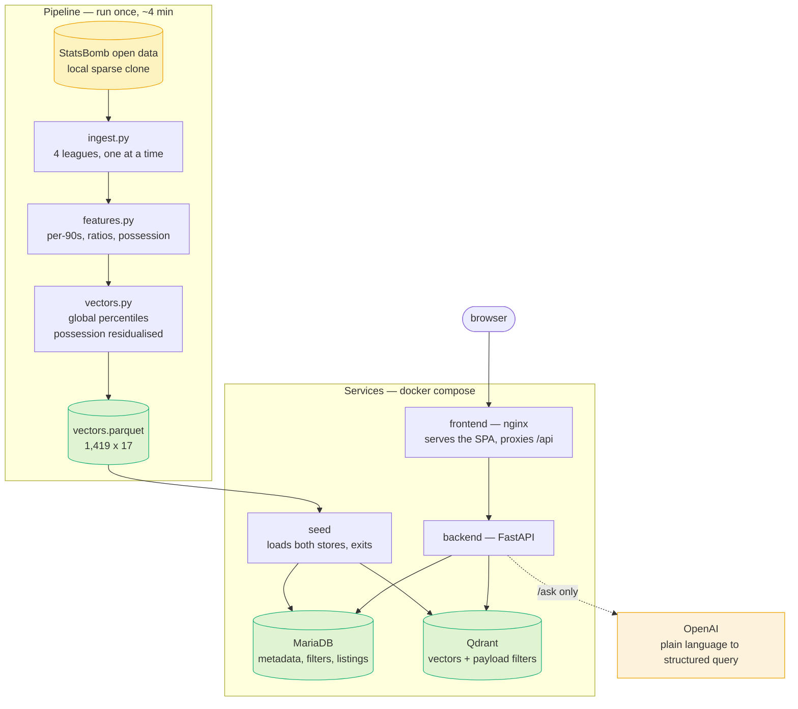

# scoutvec

Find footballers who play like a given player, across four leagues, from event
data alone.

Ask it for players similar to Gerard Piqué and it returns Samuel Umtiti — who
signed for Barcelona that summer — followed by Raúl Albiol, Jan Vertonghen and
John Stones. **Position is never given to the model.** That the neighbours of a
centre-back are centre-backs is an emergent property of the event profile, and
it is the main evidence that the vector captures playing style rather than
activity volume.

```
~ Messi (W, Barcelona)       ~ Busquets (DM, Barcelona)     ~ Piqué (CB, Barcelona)
.984 Candreva (Lazio)        .973 Dier (Tottenham)          .991 Umtiti (Lyon)
.968 Saponara (Empoli)       .972 Iturraspe (Athletic)      .988 Albiol (Napoli)
.961 Vela (R. Sociedad)      .971 Lucas Leiva (Liverpool)   .985 Armand (Rennes)
.961 Halilović (Gijón)       .969 Schneiderlin (Man Utd)    .978 Víctor Ruíz (Villarreal)
.961 Neymar (Barcelona)      .968 Fuego (Valencia)          .977 Vertonghen (Tottenham)
.957 Insigne (Napoli)        .967 De Roon (Atalanta)        .975 Mascherano (Barcelona)
.955 Ben Arfa (Nice)         .966 Kéita (Roma)              .975 Stones (Everton)
.951 Papu Gómez (Atalanta)   .966 Romao (Marseille)         .974 Rekik (Marseille)
```

Messi's neighbours are worth a second look. They are not the other superstars —
they are Insigne, Ben Arfa and Papu Gómez. Because the vector is adjusted for
team possession, the question it answers is *"who plays like this at a club that
does not have 67% of the ball"*, which is the question a scout actually has.

<p align="center">
  
  &nbsp;
  
</p>

## What it does

- **Similar players** — nearest neighbours by cosine, filterable by role and
  league. "Messi's profile, but in the Premier League" returns Payet, Bolasie
  and Tadić.
- **Target-profile search** — describe a profile by hand with no reference
  player (high shooting, high final-third touches, low interceptions) and get
  the players who match. This is the mechanism a natural-language layer would
  drive.
- **Side-by-side comparison** — up to four players on a 17-axis percentile
  radar, with a table view of the same numbers.
- **Plain-language search** — *"un central que saque el balón jugado y gane de
  cabeza"* returns Laporte and Chiellini; *"a poacher who lives in the box and
  never defends"* returns the poachers. Ask in any language.

### How the language layer stays honest

The model never answers *who is similar to whom*. It only translates the
request into a structured query — a set of percentile adjustments plus optional
role and league filters — and the same deterministic vector search that powers
every other endpoint executes it. The structured query comes back with the
results:

```
> un central que saque el balón jugado y gane de cabeza
  role=CB  k=8
    prog_pass_p90   0.70   <- "saque el balón jugado"
    aerial_win      0.70   <- "gane de cabeza"
  0.921 Aymeric Laporte    (Athletic Club, CB)
  0.918 Giorgio Chiellini  (Juventus, CB)
```

Every adjustment carries the words from the request that justify it, and the
17-dimension profile is *derived* from those adjustments — anything not listed
stays at 0.5. That is deliberate: an earlier version had the model emit the
profile and the prose separately, and it produced an explanation claiming it
had moved two dimensions it never touched. Two sources of truth can disagree;
one cannot. If the players are wrong, you can see precisely which dimension
was misread.

## Two datasets

The pipeline is not tied to one set of leagues. A dataset is four leagues of
one season, and each is its own vector space — percentiles are global *within*
a dataset and are never compared across them.

| dataset | leagues | players | events | role purity @8 |
|---|---|---|---|---|
| `men-2015-16` | La Liga, Premier, Serie A, Ligue 1 | 1,419 | 5.3M | 76.8% |
| `women-2023-24` | Liga F, FA WSL, Frauen Bundesliga, Serie A Women | 740 | 2.2M | 67.5% |

```bash
python -m scoutvec.ingest   -d women-2023-24
python -m scoutvec.features -d women-2023-24
python -m scoutvec.vectors  -d women-2023-24
```

The women's 2023/24 set is the most recent *complete* multi-league season
StatsBomb open data offers. The recent men's data is a trap worth naming: the
Bundesliga 2023/24 files look like a season and are 34 matches, all of them
Bayer Leverkusen's — the same shape as the "La Liga is Messi-only" problem
documented in the log. Always check match count *and* team count.

It measurably works less well than the men's set: 67.5% role purity against
76.8%, and possession clustering of 0.592 against 0.450. Half the players and
a third of the matches per league make every per-90 noisier and every
percentile coarser. Reported rather than hidden — the method transfers, the
sample size does not.

## The vector

Taking `men-2015-16` as the worked example: 1,419 outfield players with 600+
minutes, from 5.3M StatsBomb events across **La Liga, Premier League, Serie A
and Ligue 1, 2015/16**.

Each player is 17 dimensions — 11 per-90 volumes and 6 ratios:

| | |
|---|---|
| **Volumes** | passes, shots, dribbles, pressures, carries, ball receipts, duels, interceptions, clearances, progressive passes, progressive carries |
| **Ratios** | pass completion, pass completion under pressure, forward-pass share, long-pass share, share of touches in the final third, aerial duels won |

Three decisions do most of the work:

**Percentiles are global, never within-role.** Ranking inside each role
flattens every role to an identical uniform distribution, and the vector loses
all information about what kind of player it describes. The pipeline asserts
this: with a global rank at most one player can hold percentile 1.0 in any
metric, so more than one is a loud failure.

**Every feature is residualised against team possession.** A Barcelona player
sees the ball 1.74× as often as a Carpi player, and raw volumes measure that as
much as they measure the player. The correction is to subtract the fitted line,
not to divide — the relationship is affine, so dividing overshoots and injects a
possession signal of the opposite sign.

**Position is not an input.** It is used only as a query-time filter and as a
way to measure whether the space works.

## Does it work

Measured over all 1,419 players, on their eight nearest neighbours:

| | value | chance baseline |
|---|---|---|
| neighbours sharing the query's role | **76.8%** | 17.2% |
| neighbours who are club teammates | 2.5% | 1.3% |
| corr(query's team possession, neighbours') | 0.450 | 0.000 |

Role coherence at 4.5× chance, with position never given to the model, is the
result worth having. The other two rows are honest reporting of what is *not*
fixed — see limitations.

## What it cannot do

- **Team context still leaks.** 0.450 possession correlation against a 0.000
  baseline. Residualising helped (it was 0.695); it did not solve it. What
  remains is tactical style, which possession does not capture: a side that
  defends deep makes all its defenders look alike.
- **No age and no market value.** StatsBomb open data has neither, so *"find a
  young replacement for X"* is unanswerable. Only *"find a similar profile"* is.
- **Minutes are approximated** from each player's first and last event in a
  match. This undercounts goalkeepers and dominant-team centre-backs. Good
  enough for a 600-minute cut, not for anything finer.
- **Event data only.** No tracking, so no off-ball movement and no pitch
  control. A player's value without the ball is largely invisible here.
- **One season, 2015/16.** The architecture is season-agnostic — the source is
  two constants — but this is a portfolio piece, not a live scouting tool.
- **Goalkeepers are excluded.** Their event profile is not comparable and would
  distort the percentile distribution.

## Running it

Requires the [StatsBomb open data](https://github.com/statsbomb/open-data)
repository cloned locally:

```bash
git clone --depth 1 --filter=blob:none --sparse \
  https://github.com/statsbomb/open-data.git ~/code/open-data
cd ~/code/open-data && git sparse-checkout set data/matches data/events
```

Build the data (about four minutes end to end):

```bash
pip install -r requirements.txt
python -m scoutvec.ingest      # 5.3M events -> data/events.parquet
python -m scoutvec.features    # -> players.parquet
python -m scoutvec.vectors     # -> vectors.parquet, with the percentile assertion
python -m scoutvec.similarity  # nearest neighbours in the terminal
```

### With Docker

`vectors.parquet` is committed (550 KB), so the stack runs without downloading
StatsBomb or building anything:

```bash
cp .env.example .env           # add your OPENAI_API_KEY for /ask
python preflight.py            # checks the published port is free
docker compose up -d --build   # http://localhost:8090
```

Everything except `/ask` works without an OpenAI key; `/ask` returns 503.

Four services. **Only the frontend publishes a port**; the backend, MariaDB and
Qdrant talk over the compose network and cannot collide with anything else on
the machine.

```
frontend  nginx + built Vite app       :8090 -> 80   (the only published port)
backend   FastAPI / uvicorn            internal
mariadb   metadata, filters, listings  internal
qdrant    the 1,419 vectors            internal
seed      loads the parquet into both, then exits
```

nginx proxies `/api/` to the backend, which is what makes one published port
enough. `seed` runs once and the backend waits for it to exit successfully.

### Without Docker

```bash
uvicorn scoutvec.api:app --port 8000    # SCOUTVEC_BACKEND=numpy by default here
cd web && npm install && npm run dev     # http://localhost:5180
```

Set `SCOUTVEC_BACKEND=numpy` and the API skips both databases and reads
`vectors.parquet` into memory — that is the development path, and it needs no
services at all.

**On the databases, honestly:** 1,419 × 17 floats is a numpy matrix-vector
product, and numpy beats both stores at this size. MariaDB and Qdrant are here
as the shape the system would take two orders of magnitude further up —
MariaDB doing listings, substring search and filters, Qdrant doing filtered
approximate nearest neighbours. They are not a performance decision, and the
numpy backend is kept working precisely so the comparison stays honest. Both
paths are verified to return identical neighbours.

| endpoint | |
|---|---|
| `GET /meta` | features, roles, leagues, teams |
| `GET /players` | filter by name, league, role, team |
| `GET /players/{id}` | one player's 17-dimension profile |
| `GET /similar/{id}` | nearest neighbours, `?role=`, `?same_role=`, `?league=` |
| `POST /similar/target` | hand-built profile, no reference player |
| `POST /ask` | plain-language query -> structured query + results |
| `GET /compare?ids=` | several profiles in one call |

Interactive API docs at `http://localhost:8000/docs`.

## Architecture

Two halves that never run at the same time. The pipeline is batch work you run
once; the services are what stays up.



Only nginx publishes a port. The backend, MariaDB and Qdrant talk over the
compose network, so nothing else on the host can collide with them and nothing
but the frontend is reachable from outside.

`SCOUTVEC_BACKEND=numpy` cuts MariaDB and Qdrant out entirely and reads
`vectors.parquet` into memory — the development path, and the reference the
store-backed path is checked against.

## Layout

```
compose.yaml      four services; only the frontend publishes a port
preflight.py      refuses to start if the published port is taken
Dockerfile        backend image
scoutvec/
  fetch.py        local StatsBomb reader
  ingest.py       events -> data/events.parquet, one league at a time
  features.py     per-player aggregation, ratios, possession share
  roles.py        ~24 StatsBomb positions -> 6 roles
  vectors.py      global percentiles, possession residualisation, the vector
  similarity.py   cosine search; also runs standalone as a CLI
  store.py        MariaDB schema + Qdrant collection + the seed
  nl.py           plain language -> structured query (OpenAI)
  api.py          FastAPI, with pluggable numpy / stores backends
web/              React + Vite + TypeScript; the radar is hand-written SVG,
                  no chart library. nginx serves it and proxies /api.
```

[`WRITEUP.md`](WRITEUP.md) is the long-form version: what the data taught me,
the two wrong turns worth reading about, and what the model cannot do.
`project.md` is the running engineering log behind it.

## Data

[StatsBomb open data](https://github.com/statsbomb/open-data), used under its
licence. This project is not affiliated with StatsBomb or with any club.
